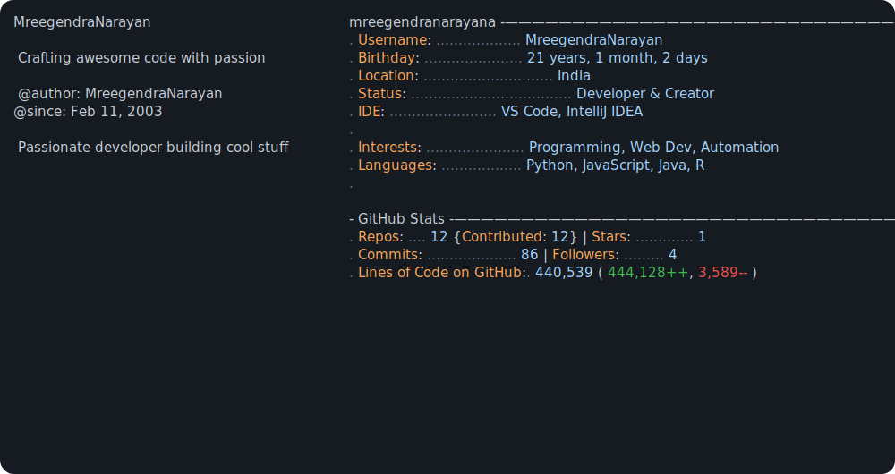
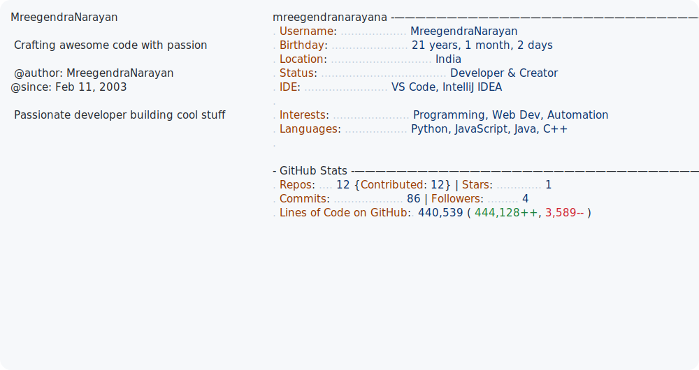

# 🚀 GitHub Profile Generator for MreegendraNarayan

Your personalized GitHub profile README generator is ready!

## ✅ What's Been Set Up

1. **generate_profile.py** - Customized Python script for your GitHub profile
   - Configured with your username: `MreegendraNarayan`
   - Birthday set to: February 11, 2003
   - Pulls all your GitHub stats (commits, stars, repos, LOC, followers)

2. **dark_mode.svg** & **light_mode.svg** - Beautiful SVG profile cards
   - Updated with your information
   - Auto-updated by the Python script with live stats

3. **.env** - Secure environment variables
   - Contains your GitHub API token and username

## 🛠️ How to Use

### Step 1: Install Required Packages
```bash
pip install python-dateutil requests lxml python-dotenv
```

### Step 2: Run the Generator (First Time)
```bash
python generate_profile.py
```

This will:
- Fetch all your GitHub stats from the GitHub API
- Update `dark_mode.svg` and `light_mode.svg` with your live data
- Cache repository data for faster future runs
- Show timing information for each operation

### Step 3: Add SVGs to Your README

In your GitHub profile README (`~/README.md`), add:

```markdown
# Hi there! 👋

## 📊 My GitHub Profile



Or for light mode:


```

## 🔄 Automate It (Optional)

### Using GitHub Actions
Create `.github/workflows/update-readme.yml`:

```yaml
name: Update GitHub Profile

on:
  schedule:
    - cron: '0 0 * * *'  # Daily at midnight
  workflow_dispatch:

jobs:
  update:
    runs-on: ubuntu-latest
    steps:
      - uses: actions/checkout@v3
      - uses: actions/setup-python@v4
        with:
          python-version: '3.11'
      - name: Install dependencies
        run: pip install python-dateutil requests lxml python-dotenv
      - name: Generate profile
        env:
          ACCESS_TOKEN: ${{ secrets.GITHUB_TOKEN }}
          USER_NAME: MreegendraNarayan
        run: python generate_profile.py
      - name: Commit and push
        run: |
          git config --global user.name "GitHub Action"
          git config --global user.email "action@github.com"
          git add *.svg
          git commit -m "Update profile stats" || true
          git push
```

## 📁 Project Structure

```
.
├── generate_profile.py    # Main script (customized for you)
├── dark_mode.svg         # Dark theme profile card
├── light_mode.svg        # Light theme profile card
├── .env                  # Your GitHub API credentials
├── cache/                # Cached repository data
└── README.md             # Your profile
```

## 🔑 Security Notes

- ✅ Your `.env` file is in `.gitignore` (keep it safe!)
- ✅ Never commit your `ACCESS_TOKEN` to Git
- ✅ If you accidentally push it, regenerate your token immediately

## 🎯 What Gets Tracked

Your script automatically updates:
- **Age**: Days since Feb 11, 2003
- **Commits**: Total commits across all repos
- **Stars**: Stars on your own repositories
- **Repositories**: Owned + contributed repos
- **Lines of Code**: Added/deleted/net across all code
- **Followers**: Your current follower count

## 🐛 Troubleshooting

**Token not found?**
- Ensure `.env` has proper credentials
- Run: `python generate_profile.py`

**API rate limit hit?**
- The script caches data, so subsequent runs are faster
- GitHub allows 5,000 API calls/hour for authenticated users

**SVG not updating?**
- Check that element IDs in SVG match the script
- Verify `.env` file has your actual token

## 📝 Customization

Want to customize further? Edit:
- **SVG colors**: Modify the `<style>` section in `dark_mode.svg` / `light_mode.svg`
- **Stats display**: Edit the `<tspan>` elements in the SVG files
- **Birthday**: Change line in `generate_profile.py`: `BIRTHDAY = datetime.datetime(2003, 2, 11)`

## 🎉 You're All Set!

Run `python generate_profile.py` now to see your live GitHub stats!

Questions? Check the code comments in `generate_profile.py` for more details.

---

**Created**: March 14, 2026  
**For**: MreegendraNarayan  
**Inspired by**: Andrew6rant's amazing GitHub profile automation
